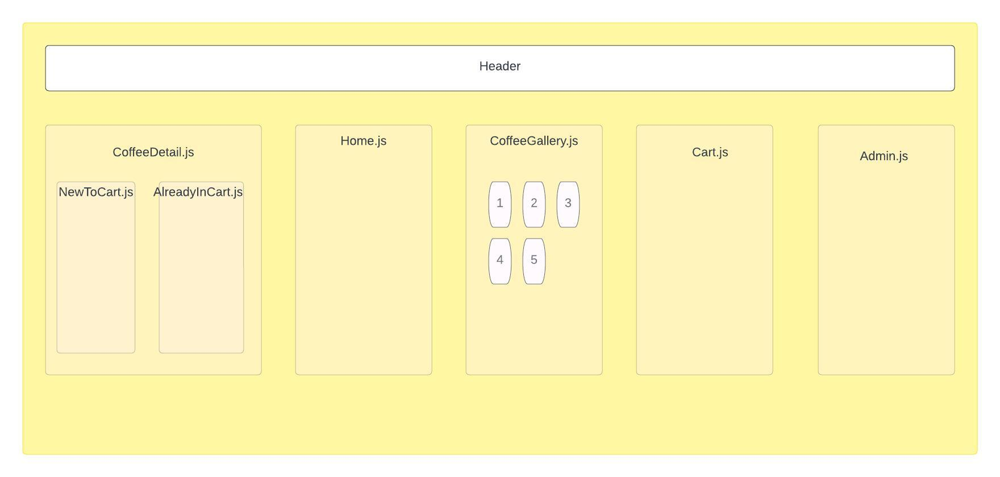

# _Coffee Inventory_

#### By _**Robert Onstott**_

#### _This is a web app built with React.js that allows a hypothetical coffee retailer to keep track of their inventory, and allows customers to browse available inventory, add orders to their cart, and purchase. Purchases will be reduced from the available inventory._

## Technologies Used

* _React.js_
* _Node_
* _create-react-app_
* _NPM_

## Description

_This web app represents a combined retail site and inventory tracker for a fictitious dealer of whole coffee beans. The user can navigate to the `Buy Beans` page to see a list of all of the coffees that are being sold, including some relevant descriptive information, such as tasting notes, price, roast style, and origin. By clicking on any one of these, the user will be directed to a details view, where they can specify the amount of this coffee that they would like to add to their cart. When they are done shopping, the user can navigate to the `Cart` view to confirm their purchase. At this point, the quantities of purchased beans will be subtracted from the inventory. It is generally assumed that the beans are purchased in unit quantities of 130lb burlap sacks._

## Setup/Installation Requirements

* _Clone this repository to your local machine_
* _Download Node and NPM if you haven't already `https://docs.npmjs.com/downloading-and-installing-node-js-and-npm`_
* _Navigate to the project directory `cd coffee-inventory` and enter this command: `npm run start`_
* _With the program running, copy the url `http://localhost:3000` into a browser window_
* _You are now interacting with the app in the browser and can access its functions._
* _Click `Buy Beans` in the header to see the beans that are available. From that page, click on any given bean to add it to your cart_
* _Click on `Cart` to see your cart and click Purchase to reduce the bean quantities from inventory_
* _Click `Admin` to access a form where you can add a new bean variety to inventory_

## Known Bugs

* _There is limited error handling, and in most cases submitting non-numerical values to form fields that require numbers will convert the inventory amount to `NaN`_

## Component Diagram

## Available Scripts

In the project directory, you can run:

### `npm start`

Runs the app in the development mode.\
Open [http://localhost:3000](http://localhost:3000) to view it in your browser.

The page will reload when you make changes.\
You may also see any lint errors in the console.

### `npm test`

Launches the test runner in the interactive watch mode.\
See the section about [running tests](https://facebook.github.io/create-react-app/docs/running-tests) for more information.

### `npm run build`

Builds the app for production to the `build` folder.\
It correctly bundles React in production mode and optimizes the build for the best performance.

The build is minified and the filenames include the hashes.\
Your app is ready to be deployed!

See the section about [deployment](https://facebook.github.io/create-react-app/docs/deployment) for more information.

## License

_MIT_

_Permission is hereby granted, free of charge, to any person obtaining a copy of this software and associated documentation files (the "Software"), to deal in the Software without restriction, including without limitation the rights to use, copy, modify, merge, publish, distribute, sublicense, and/or sell copies of the Software, and to permit persons to whom the Software is furnished to do so, subject to the following conditions:_

_The above copyright notice and this permission notice shall be included in all copies or substantial portions of the Software._

_THE SOFTWARE IS PROVIDED "AS IS", WITHOUT WARRANTY OF ANY KIND, EXPRESS OR IMPLIED, INCLUDING BUT NOT LIMITED TO THE WARRANTIES OF MERCHANTABILITY, FITNESS FOR A PARTICULAR PURPOSE AND NONINFRINGEMENT. IN NO EVENT SHALL THE AUTHORS OR COPYRIGHT HOLDERS BE LIABLE FOR ANY CLAIM, DAMAGES OR OTHER LIABILITY, WHETHER IN AN ACTION OF CONTRACT, TORT OR OTHERWISE, ARISING FROM, OUT OF OR IN CONNECTION WITH THE SOFTWARE OR THE USE OR OTHER DEALINGS IN THE SOFTWARE._

Copyright (c) _Feb 2023_ _Robert Onstott_

